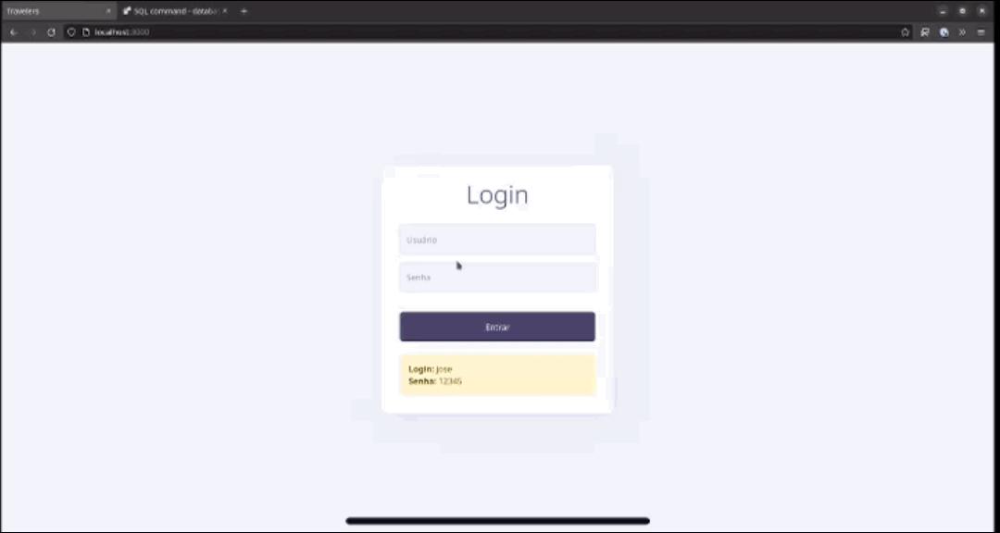
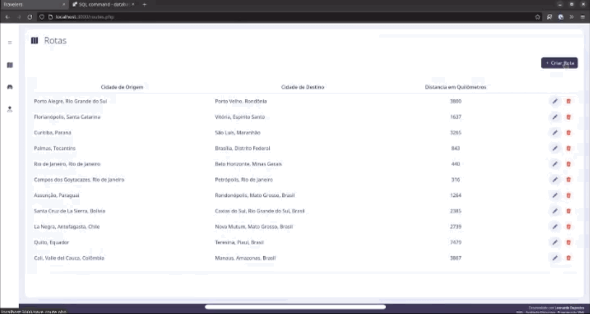
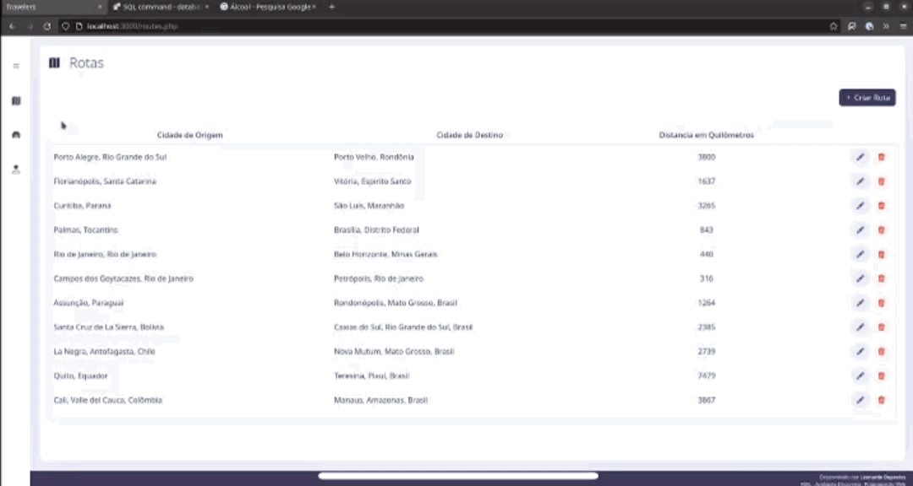
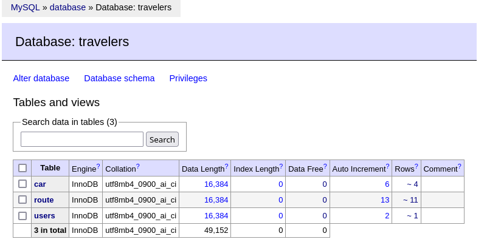
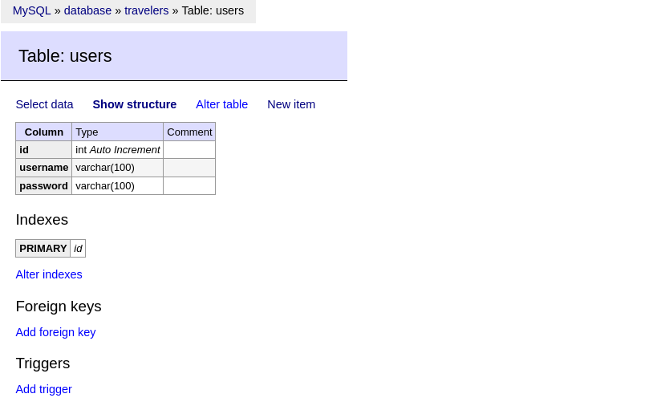
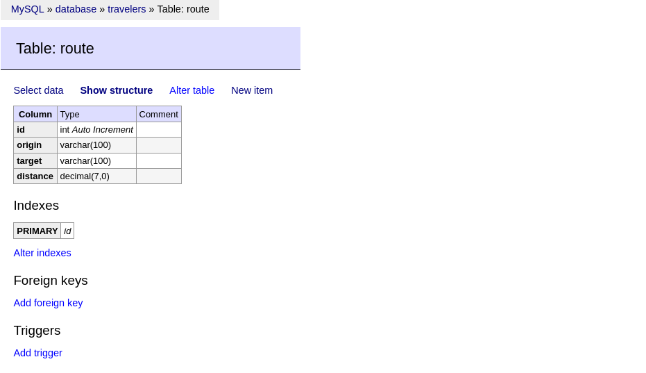
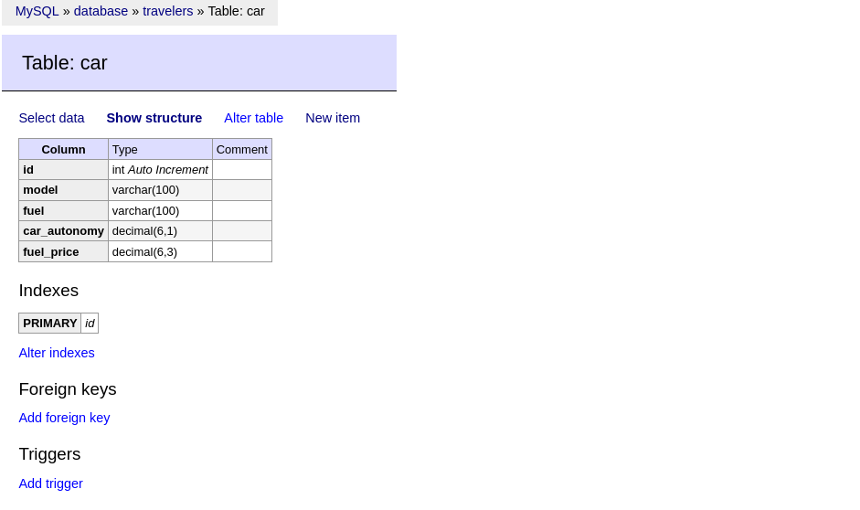

# FAEL - Avaliação Discursiva - Programação Web

Projeto desenvolvido utilizando as tecnologias **PHP**, **HTML**, **CSS**, **JavaScript** e **MySQL** para a disciplina de **Programação Web** do curso **Superior em Análise e Desenvolvimento de Sistemas** da Faculdade **FAEL**.

## Estrutura do Projeto

```shell
php-travelers/
├── src
│   ├── config
│   ├── controllers
│   ├── exceptions
│   ├── models
│   └── views
├── public
│   ├── assets
│   │   └── css
│   │   └── fonts
│   │   └── img
│   │   └── js
│   └── index.php
├── resources
│   ├── gifs
│   └── screenshots
└── scrips

```

## Setup

### MAMP Server

1\. Instale o XAMPP Server.

2\. Na tela "**Web Server**" selecione a pasta **./public**.

3\. Verifique a **porta** do **MySQL Server** e se necessario atualize no arquivo **env.ini**.

### DevContainer

1\. Instale o [Docker](https://docs.docker.com/get-docker/) e o [Docker Compose](https://docs.docker.com/compose/install/).

2\. Download e instale o [VSCode](https://code.visualstudio.com/docs/setup/setup-overview).

3\. Instale e habilite a extensão [Remote - Containers](https://marketplace.visualstudio.com/items?itemName=ms-vscode-remote.remote-containers).

4\. Pressione **Command (Control)** + **Shift** + **P** do teclado para abrir o VS Code Command Palette.

5\. Selecione a opção: **Remote-Container: Reopen in Container**.

###  Banco de Dados

Está disponível na pasta **./scripts/database-setup.sql** o script para realizar a criação do database, tabelas e insert dos registros de exemplos no banco de dados.


## Funcionalidades

As funcionalidades descritas abaixo realizam as quatro operações **CRUD** (Create, Read, Update e Delete).

- [Screenshots da aplicacão]().

### Login

Realiza o login na aplicação através do usuário e senha.

```
Usuário: jose
Senha: 12345
```



### Rotas

A funcionalidade **Rotas** realiza a listagem de todas as rotas previamente cadastrados e permite que o usuário edite ou remova uma rota. Ao clicar no botão "Criar Rota" o usuário é redirecionado para um formulário para cadastro de uma nova rota.



### Veículos

A funcionalidade **Veículos** realiza a listagem de todas as rotas previamente cadastradas e permite que o usuário edite ou remova um veículo. Ao clicar no botão "Criar Veículo" o usuário é redirecionado para um formulário para cadastro de um novo veículo.



### Viagens

A funcionalidade **Viagens** realiza a listagem com todas as combinações possíveis entre Rotas e Veículos incluindo a coluna **"Total de Litros"** informando o valor total de combustível utilizado pelo veículo para percorrer a rota e também o **"Preço Total"** do combustível.


## Database

Para o registro das informações da aplicação foi utilizado o banco de dados MySQL e para administração do banco de dados foi utilizado o Adminer.

Foi criado o database **travelers**.



### Tables

- **users**: tabela para registro dos usuários.



- **route**: tabela para registro das rotas.



- **car**: tabela para registro dos veículos.



Para apresentar os dados da funcionalidade **viagem** foi realizada uma query com **CROSS JOIN** entre as tabelas **car** e **route**.